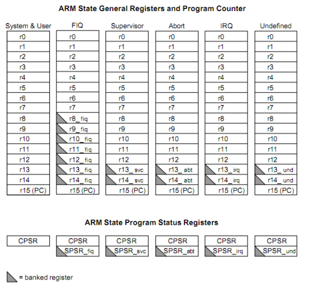

# ARM 相关

## 专业术语

## 寄存器

共有 37 个寄存器(都是 32 位的寄存器):
- 31 个通用寄存器
- 6 个状态寄存器

共有 7 种不同的处理器模式

| 模式  |        描述        |
| :---: | :----------------: |
| User  |      用户模式      |
|  FIQ  |    快速中断模式    |
|  IRQ  |    普通中断模式    |
|  Svc  |      管理模式      |
| Abort |  数据访问中止模式  |
|  Und  | 未定义指令中止模式 |
|  Sys  |      系统模式      |

r0~r3 主要用于子程序间传递参数
r4~r11 主要用于保存局部变量
r12 用作子程序间scratch 寄存器，即 ip 寄存器
r13 通常用做栈指针，即 sp
r14 寄存器又被称为连接寄存器（lr），用于保存子程序以及中断的返回地址
r15 用作程序计数器（pc）

### 流水线机制

> 当正确读取了 PC 的值后，该值为当前指令地址加 8 个字节，即 PC 指向当前指令的下两条指令地址

### 寻址方式

## 汇编指令

> ARM是RISC结构，数据从内存到CPU间的移劢只能通过L/S指令来完成，也就是ldr/str指令

### IMPORT 和 EXPORT

> IMPORT 表示这是一个外部变量的符号, 不在本文件中定义
> EXPORT 表示本程序用到得变量提供给其他模块调用

### AREA

> AREA伪指令用于定义一个代码段或数据段

### 数据处理指令

#### MOV 

> MOV{条件}{S} 目的寄存器，源操作数

### LDR 加载指令

> LDR{条件} 目的寄存器 , <存储寄存器>

| 指令 |                           描述                           |
| :--: | :------------------------------------------------------: |
| LDR  |                      字数据加载指令                      |
| LDRB | 字节数据加载指令 只拷贝低8位, 目的寄存器高24位清零  |
| LDRH | 半字数据加载指令 只拷贝低16位, 目的寄存器高16位清零 |

### STR 存储指令

> STR{条件} 源寄存器，<存储器地址>

| 指令 |       描述       |
| :--: | :--------------: |
| STR  |  字数据存储指令  |
| STRB | 字节数据存储指令 |
| STRH | 半字数据存储指令 |

### CMP 和 TST

> 更新CPSR, CMP - 做减法 TST - 按位与 

### 跳转指令

> B、BL、BX、BLX、BXJ

#### B

> B{条件} 目标地址

#### BL

> BL{条件} 目标地址

跳转之前，会在寄存器R14 中保存PC 的当前内容，因此，可以通过将R14 的内容重新加载到PC 中

### 逻辑指令

| 指令 |       描述       |
| :--: | :--------------: |
| AND  |  逻辑与操作指令  |
| ORR  |  逻辑或操作指令  |
| EOR  | 逻辑异或操作指令 |

